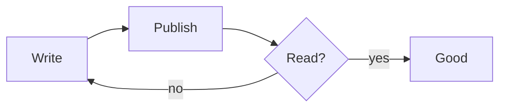

+++
title = "Hello, world"
date = 2026-07-20
draft = false
topics = ["Meta", "Design"]
+++

This is a sample post to show how body text reads in the **basic** theme.
The measure is capped so lines stay comfortable, and the palette is pure
black and white until you hover something clickable.

## A heading

Some more text. Here is [a link](https://example.org) — hover it to see the
pop of colour. Inline `code` looks like this.


> A blockquote sits quietly to one side.

## A repo







## Swatches



## A diagram



```js
function hello() {
  return "world";
}
```

## Some math

Inline, like $E = mc^2$, sits in the sentence. Display math gets its own line:

$$\int_{-\infty}^{\infty} e^{-x^2}\,dx = \sqrt{\pi}$$

That's it.

## Imported code



## A gist



## A video



## Contact

Questions? .

Default text: 

## Admonitions

A plain note, no title override.

Use `pnpm dev` for live reload while writing.

This regenerates the fingerprinted bundle.

Never commit `.env` files.

## Details


Hidden content with **markdown** support, revealed via the native `<details>` element.


## Badges

  

## Package cards







## A Bluesky post



## A footnote

Here's a claim that needs backing up.[^1]

[^1]: This is the footnote content, rendered by goldmark natively.
