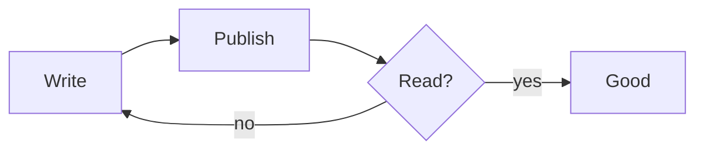

+++
title = "Hello, world"
date = 2026-07-20
draft = false
topics = ["Meta", "Design"]
+++

This is a sample post to show how body text reads in the **basic** theme.
The measure is capped so lines stay comfortable, and the palette is pure
black and white until you hover something clickable.

## A heading

Some more text. Here is [a link](https://example.org) — hover it to see the
pop of colour. Inline `code` looks like this.


> A blockquote sits quietly to one side.

## A diagram



```js
function hello() {
  return "world";
}
```

## Some math

Inline, like $E = mc^2$, sits in the sentence. Display math gets its own line:

$$\int_{-\infty}^{\infty} e^{-x^2}\,dx = \sqrt{\pi}$$

That's it.
