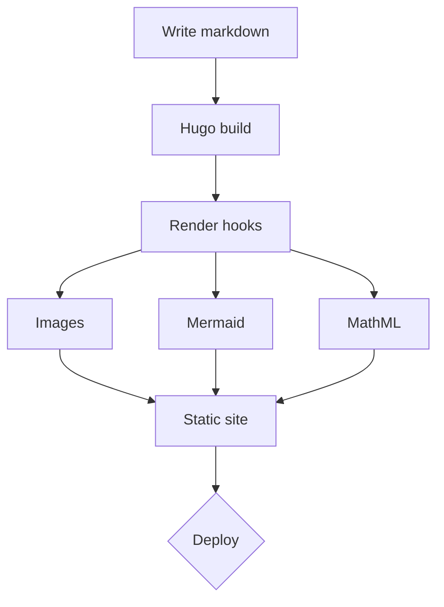

+++
title = "Drawing the pipeline"
date = 2026-07-27
draft = false
topics = ["Design", "Reference"]
+++

Sometimes a diagram says it faster than a paragraph. A build pipeline, start
to finish:

Each render hook handles one concern, and the whole thing stays static — no
runtime dependencies to break.
